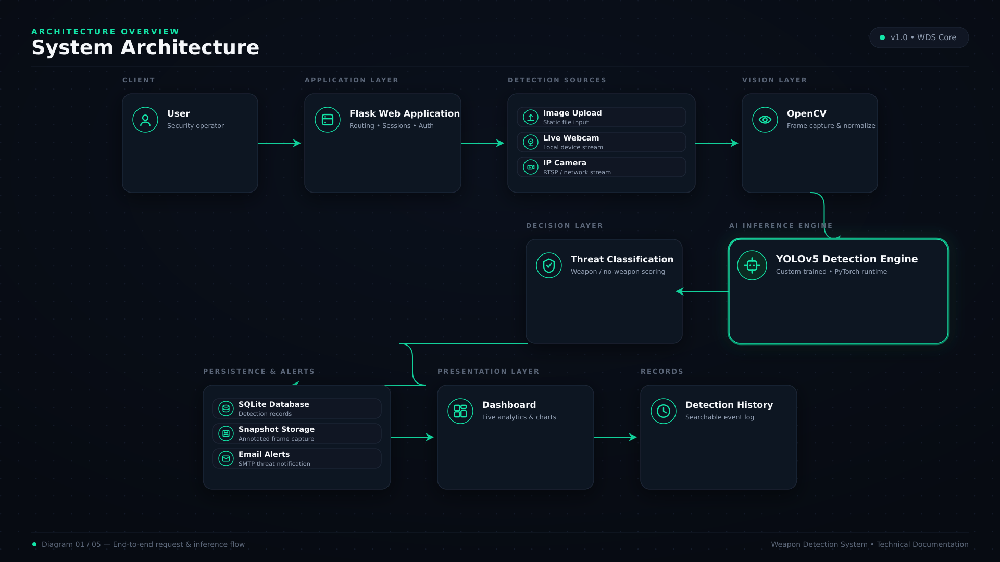
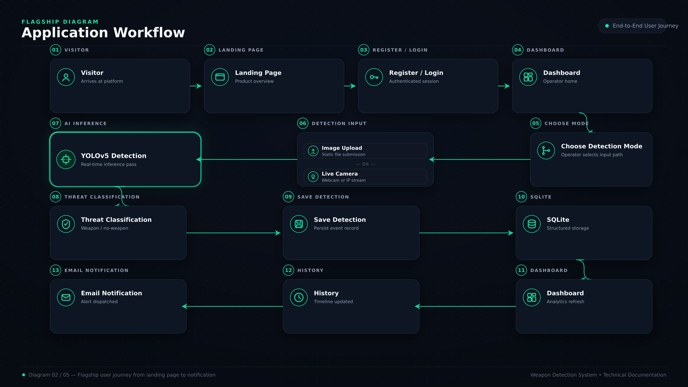
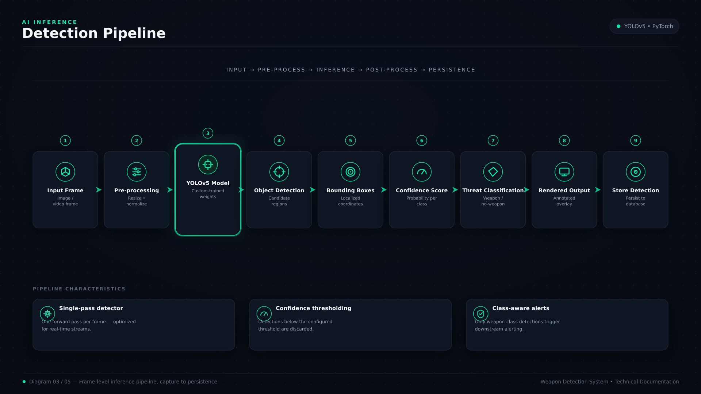
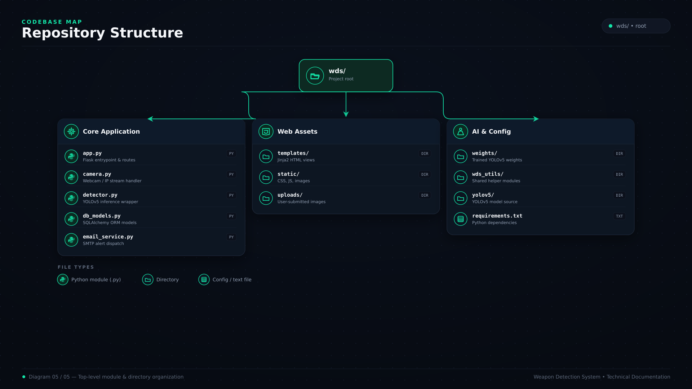

<div align="center">

# 🛡️ Weapon Detection System (WDS)

**AI-powered weapon detection for images, webcams, and IP cameras — built with YOLOv5, Flask, and OpenCV.**

Upload an image or go live, and WDS detects firearms, knives, and blunt weapons in real time, saves the evidence, logs the event, and emails an alert — automatically.


</div>

---

## Contents

- [Overview](#overview)
- [Features](#features)
- [How Detection Works](#how-detection-works)
- [Architecture](#architecture)
- [Tech Stack](#tech-stack)
- [Project Structure](#project-structure)
- [Getting Started](#getting-started)
- [Configuration](#configuration)
- [Running the App](#running-the-app)
- [Usage](#usage)
- [Database Schema](#database-schema)
- [Testing](#testing)
- [Design System](#design-system)
- [Roadmap](#roadmap)
- [Contributing](#contributing)
- [License](#license)

---

## Overview

**Weapon Detection System (WDS)** is a full-stack Flask application that wraps a custom-trained **YOLOv5** model in a real, usable security workflow — not just an inference script.

It accepts three kinds of input:

- 🖼️ **Uploaded images**
- 🎥 **A local webcam**
- 📡 **An IP / mobile camera stream** (e.g. an IP Webcam app URL)

Every frame or image is run through the detection model. If a genuine threat class is found (a firearm, knife, or blunt weapon — see [How Detection Works](#how-detection-works)), WDS:

1. Draws bounding boxes and confidence scores on the frame
2. Saves an annotated snapshot to disk
3. Writes a `Detection` record to the SQLite database
4. Sends an HTML email alert with the snapshot attached (rate-limited so a continuous live feed doesn't spam your inbox)
5. Surfaces the event on the dashboard and in the detection history

## Features

### 🔐 Authentication
- Email/username signup and login
- Passwords hashed with **Flask-Bcrypt** (never stored in plaintext)
- Session-based access control — every detection route requires a logged-in user

### 🤖 AI Detection
- Custom-trained YOLOv5 model, loaded locally via `torch.hub`
- Configurable confidence threshold (`model.conf = 0.45` by default)
- Raw model classes are mapped to a small set of human-readable threat categories before anything is stored or alerted on

### 📤 Image Upload Detection
- Upload a single image, get an annotated result rendered back with per-object confidence scores

### 🎥 Live Webcam Detection
- Streams frames from a local webcam through `/video_feed` (MJPEG, `multipart/x-mixed-replace`)
- Detections are drawn on the live feed in real time

### 📡 IP Camera Detection
- Point WDS at any MJPEG/IP camera stream URL (e.g. `http://192.168.x.x:8080/video`) and it's treated exactly like a webcam

### 📧 Smart Email Alerts
- Rich HTML email with threat type, confidence, source, and timestamp
- The triggering snapshot is attached automatically
- **5-second** save cooldown and **60-second** email cooldown prevent a continuous detection from flooding the database or your inbox

### 📊 Dashboard
- Total detection count, most recent threat + confidence, and a "Recent Detections" panel (last 5 events)

### 📜 Detection History
- Every stored detection — threat type, confidence, source, timestamp, and snapshot — in one searchable, sortable view

## How Detection Works

The raw YOLOv5 output classes aren't shown to the user directly — they're normalized through a label map (`wds_utils/label_mapper.py`) before anything is logged or alerted on:

| Raw model class | Mapped to |
|---|---|
| `Rifle`, `pistol`, `shot-gun`, `submachine-gun` | **Firearm** |
| `knife` | **Knife** |
| `blunt object` | **Blunt Weapon** |
| `Gunmen`, `knife_attacker`, `person` | **Person** |

Only detections that map to `Firearm`, `Knife`, or `Blunt Weapon` are treated as **threats** — a bare `Person` detection is intentionally never stored or alerted on, even though the model may recognize people as part of a scene. For the live camera feed specifically, `Person`-class detections are filtered out before the threat check runs at all.

## Architecture

```
User
  │
  ▼
Flask Web Application  (auth, sessions, routing)
  │
  ├── Image Upload ──┐
  ├── Live Webcam ────┤
  └── IP Camera ──────┘
  │
  ▼
OpenCV  (frame capture & preprocessing)
  │
  ▼
YOLOv5 Detection Engine  (PyTorch, custom-trained weights)
  │
  ▼
Threat Classification  (wds_utils/label_mapper.py)
  │
  ├── SQLite Database        (detection records)
  ├── Snapshot Storage       (annotated frame capture)
  └── Email Alerts           (SMTP, rate-limited)
  │
  ▼
Dashboard  →  Detection History
```

> A full diagram pack (system architecture, application workflow, detection pipeline, database ER diagram, and repository map — SVG + PNG, dark theme) lives in [`docs/diagrams/`](docs/diagrams) and is embedded below.

<details>
<summary><strong>📊 Diagram Pack</strong> (click to expand)</summary>

| | |
|---|---|
|  |  |
|  |  |
|  | |

</details>

## Tech Stack

| Layer | Technology |
|---|---|
| Language | Python 3.12 |
| Backend framework | Flask |
| ORM | Flask-SQLAlchemy |
| Authentication | Flask-Bcrypt (password hashing) + Flask sessions |
| Computer vision | OpenCV |
| Deep learning | PyTorch |
| Detection model | YOLOv5 (custom-trained, loaded via `torch.hub`) |
| Database | SQLite |
| Email | SMTP (Gmail, via `smtplib` + `EmailMessage`) |
| Frontend | HTML (Jinja2), CSS, vanilla JavaScript |

Exact package versions are pinned in [`requirements.txt`](requirements.txt).

## Project Structure

```text
wds/
│
├── app.py                  # Flask entrypoint — routes, sessions, auth
├── camera.py                # Live frame generator for webcam / IP camera
├── detector.py               # Loads YOLOv5 + runs inference on a frame
├── db_models.py               # SQLAlchemy models: User, Detection
├── email_service.py            # Builds & sends the HTML alert email
├── requirements.txt
├── .env.example
├── CHANGES.md                 # Frontend redesign changelog
│
├── wds_utils/
│   └── label_mapper.py          # Raw model class → threat category
│
├── weights/
│   └── best.pt                    # Custom-trained YOLOv5 weights
│
├── yolov5/                        # YOLOv5 source (loaded locally via torch.hub)
│
├── templates/                     # Jinja2 views (base, home, login, signup,
│                                   # dashboard, upload, camera, history)
├── static/
│   ├── css/                       # variables, layout, components, per-page styles
│   ├── js/                        # per-page vanilla JS (no framework)
│   ├── results/                   # annotated upload results
│   └── snapshots/                 # annotated live-detection snapshots
│
├── uploads/                        # raw uploaded images
├── instance/                        # SQLite database (wds.db) at runtime
│
├── test_camera.py                    # standalone OpenCV webcam smoke test
└── test_email.py                      # standalone SMTP alert smoke test
```

## Getting Started

### Prerequisites
- Python 3.12+
- A webcam (optional — only needed for live webcam detection)
- A Gmail account with an [App Password](https://myaccount.google.com/apppasswords) (optional — only needed for email alerts)

### 1. Clone the repository

```bash
git clone https://github.com/YOUR_USERNAME/weapon-detection-system.git
cd weapon-detection-system
```

### 2. Create and activate a virtual environment

```bash
python -m venv .venv
```

**Windows**
```bash
.venv\Scripts\activate
```

**Linux / macOS**
```bash
source .venv/bin/activate
```

### 3. Install dependencies

```bash
pip install -r requirements.txt
```

### 4. Add the YOLOv5 source and trained weights

`detector.py` loads the model locally via `torch.hub.load(YOLO_PATH, "custom", ..., source="local")`, so it expects:

- a `yolov5/` directory at the project root containing the [Ultralytics YOLOv5](https://github.com/ultralytics/yolov5) source
- your trained weights at `weights/best.pt`

```bash
git clone https://github.com/ultralytics/yolov5.git
```

## Configuration

Copy the example environment file and fill in your own values:

```bash
cp .env.example .env
```

```env
EMAIL_ADDRESS=your_email@gmail.com
EMAIL_PASSWORD=your_google_app_password
ALERT_EMAIL=recipient@example.com
```

| Variable | Purpose |
|---|---|
| `EMAIL_ADDRESS` | Gmail account WDS sends alerts **from** |
| `EMAIL_PASSWORD` | Gmail **App Password** (not your regular password) |
| `ALERT_EMAIL` | Address that receives threat notifications |

If these aren't set, detection and storage still work — `email_service.py` simply logs `"Email credentials not configured."` and skips sending.

## Running the App

```bash
python app.py
```

The app starts on `http://0.0.0.0:5000` in debug mode. Open:

```
http://127.0.0.1:5000
```

The SQLite database (`instance/wds.db`) and its tables are created automatically on first run.

## Usage

1. **Sign up** for an account, then **log in**.
2. From the **Dashboard**, jump to **Upload**, **Camera**, or **History**.
3. **Upload** — pick an image; WDS returns the annotated result with detected classes and confidence scores.
4. **Camera** — choose *Webcam* or *IP Camera* (with a stream URL, e.g. `http://192.168.x.x:8080/video`), then start the live feed. Detections are drawn on the stream in real time; qualifying threats are saved and alerted automatically.
5. **History** — review every stored detection, newest first.

## Database Schema

Two tables, managed by **Flask-SQLAlchemy**:

**`users`**

| Column | Type | Notes |
|---|---|---|
| `id` | Integer | Primary key |
| `username` | String(100) | Unique |
| `email` | String(150) | Unique |
| `password` | String(255) | Bcrypt hash |

**`detections`**

| Column | Type | Notes |
|---|---|---|
| `id` | Integer | Primary key |
| `filename` | String(200) | Snapshot / result filename |
| `threat` | String(50) | Mapped class, e.g. `Firearm` |
| `confidence` | Float | 0.0 – 1.0 |
| `source` | String(50) | `"Image Upload"` or `"Live Camera"` |
| `timestamp` | DateTime | Defaults to `utcnow` |

An ER-style diagram of this schema is in [`docs/diagrams/database-schema.png`](docs/diagrams/database-schema.png).

## Testing

There's no automated test suite yet, but two standalone smoke-test scripts are included:

```bash
# Confirms OpenCV can open your webcam and displays a preview window
python test_camera.py

# Sends a real alert email using your .env credentials and a sample image
python test_email.py
```

## Design System

The UI ("Signal" theme) is a dark, operations-console aesthetic: mint/cyan for scanning & safety, red for threats, amber for warnings, with a recurring camera-viewfinder "reticle" motif. Typography is **Space Grotesk** (display), **Inter** (body), and **JetBrains Mono** (data, timestamps, badges). Design tokens live in `static/css/variables.css`; see [`CHANGES.md`](CHANGES.md) for the full frontend changelog.

## Roadmap

- [ ] PostgreSQL support for production deployments
- [ ] Docker / containerized deployment
- [ ] Cloud storage for snapshots
- [ ] Multi-camera monitoring
- [ ] REST API
- [ ] Role-based access control
- [ ] SMS / Telegram alert channels
- [ ] Mobile companion app

## Contributing

Contributions are welcome — fork the repo, open an issue, or submit a pull request.

## License

Licensed under the **MIT License**.

---

<div align="center">

**Tanishq Kumar Gupta**
Computer Science Engineering — AI · Computer Vision · Full-Stack Development

[GitHub](https://github.com/tanishqkumargupta)

⭐ If this project is useful to you, consider giving it a star.

</div>
